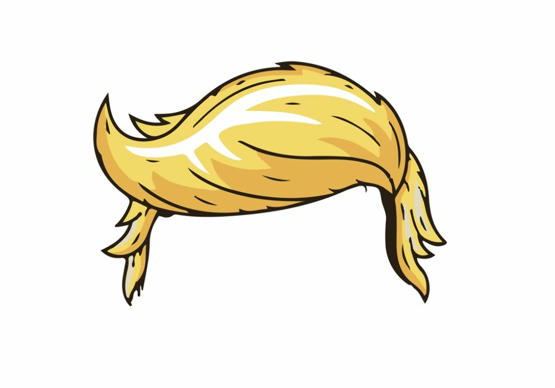

# Hairdryers!

* [Tightly coupled](coupled.md)

Examples is mostly stolen from [Dependency Injection Principles, Practices, and Patterns - Steven van Deursen and Mark Seemann](https://www.manning.com/books/dependency-injection-principles-practices-patterns)
