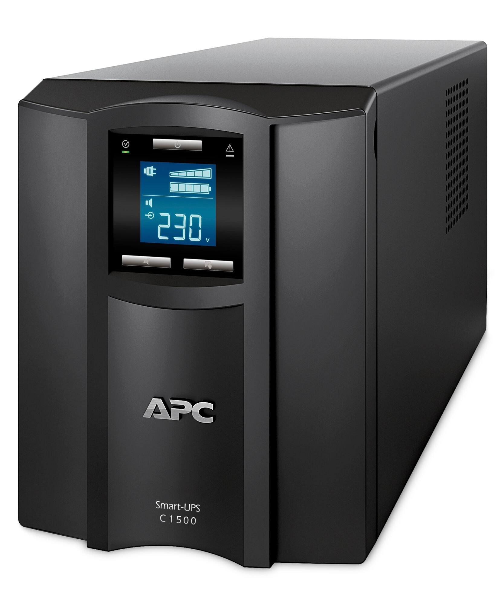

# Decorator pattern - Intercepting implementation

* UPS between socket and device
* Single Responsibility
* Ability to incrementally add new functionality

Next: [Composite design pattern](hotel_composition.md)
