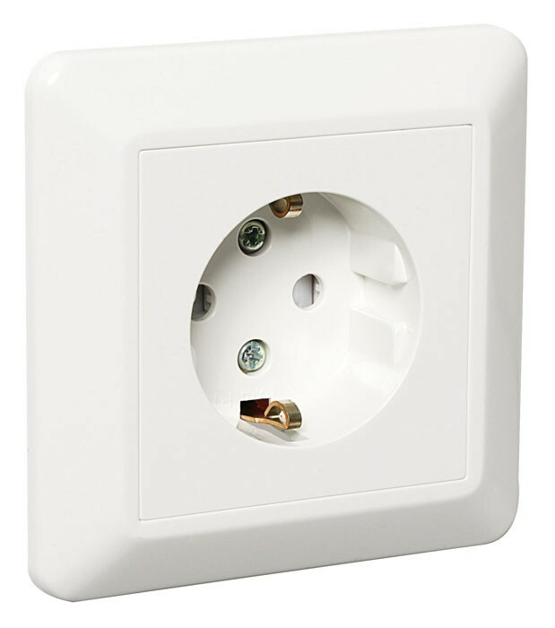
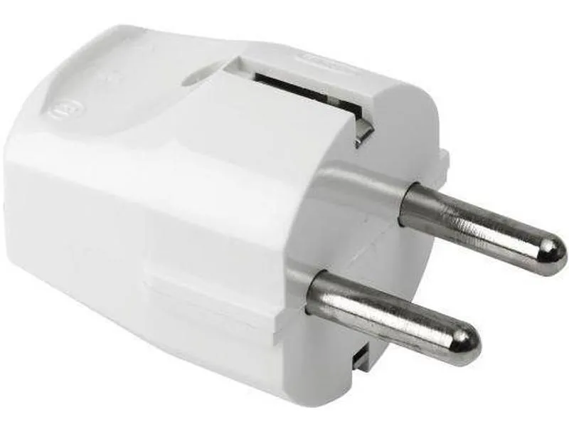

# An introduction of an interface

## Socket === interface

## Plug === interface implementation

* Enable to plug something else into the socket, no constrains as long as interface is followed. 
* interface define power and hertz, obeys the interface contract.

Next: [All constrains removed](no_constrains.md)
